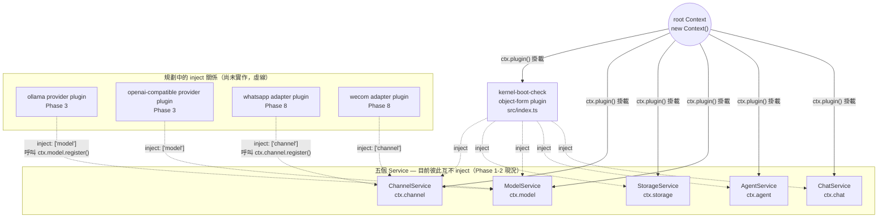

# Cordis 依賴架構圖

跟 [`system-architecture.md`](./system-architecture.md) 是同一套程式碼，但這張圖回答的是
「Cordis 的 plugin/inject 機制實際上長怎樣」，不是「產品功能怎麼串」。兩種箭頭語意不同，
不要混著看：

- **實線箭頭 = `ctx.plugin()` 掛載**（root Context 建立這個 plugin/service）
- **虛線箭頭 = `inject` 依賴宣告**（Cordis 保證被 inject 的 service 先掛載好，這個 plugin 才會執行）

現況（Phase 1-2）**五個 service 彼此互不 `inject`**——這是刻意的：`ctx.chat`/`ctx.agent`/
`ctx.model`/`ctx.storage`/`ctx.channel` 目前都是獨立的空殼或 registry，沒有互相依賴的理由。
唯一目前存在的 `inject` 關係，是 `src/index.ts` 裡驗證 kernel 有沒有全部掛載成功的
`kernel-boot-check` plugin，同時 inject 全部五個。

## 為什麼現在沒有 service 互相 inject

- `ctx.agent` 的 domain 邏輯（`assignTask`）目前是純函式，不需要真的呼叫 `ctx.model`
  去查詢 provider——`Agent.modelRef` 只是一個字串欄位，Phase 5（多 Agent 協作）真正組裝
  「用哪個 model 執行這個 Agent」的邏輯時，`AgentService` 才會需要 `inject: ['model']`。
- `ctx.chat` 的 `canAgentViewRoom` 也是純函式，吃的是 `AgentVisibility` 這個最小結構型別，
  不是真的 `Agent` 物件（原因見 `memory/MEM-20260816-phase2-domain-and-testing.md`），
  所以 `ChatService` 現在也不需要 `inject: ['agent']`。
- 這是刻意的設計，不是漏掉——過早把 service 綁在一起，之後要拆會比現在多花力氣（YAGNI）。

## 測試裡也用同一套 inject 機制

`src/plugins/model/index.test.ts`、`src/plugins/channel/index.test.ts` 各自建立一個乾淨的
`new Context()`，掛載被測 service，再掛一個 `inject: [...]` 的測試 consumer plugin——
跟上圖 `kernel-boot-check` 的寫法完全一樣，只是測試版本每個測試案例都重新建一個 Context，
彼此不共用狀態。
