# Cordis 依賴架構圖

跟 [`system-architecture.md`](./system-architecture.md) 是同一套程式碼，但這張圖回答的是
「Cordis 的 plugin/inject 機制實際上長怎樣」，不是「產品功能怎麼串」。兩種箭頭語意不同，
不要混著看：

- **實線箭頭 = `ctx.plugin()` 掛載**（root Context 建立這個 plugin/service）
- **虛線箭頭 = `inject` 依賴宣告**（Cordis 保證被 inject 的 service 先掛載好，這個 plugin 才會執行）

**Phase 4 之後，`ChatService`/`AgentService` 都 `static inject = ['storage']`**。
**Phase 5（規劃中，見 ADR-0005/0007）會新增 `ctx.orchestrator`；同樣是 Phase 5（介面）
/Phase 5.5（後端，見 ADR-0006）會新增 `ctx.sandbox`**——圖中用虛線標示尚未實作的
部分，跟已實作的五個 service 放在同一張圖，方便看出「加上 Phase 5/5.5 之後」整體長怎樣。

```mermaid
flowchart TD
    root(("root Context<br/>new Context()"))

    subgraph Services["七個 Service"]
        chat["ChatService<br/>ctx.chat<br/>static inject: ['storage']"]
        agentSvc["AgentService<br/>ctx.agent<br/>static inject: ['storage']"]
        model["ModelService<br/>ctx.model"]
        storage["StorageService<br/>ctx.storage"]
        channel["ChannelService<br/>ctx.channel"]
        orchestrator["OrchestratorService<br/>ctx.orchestrator<br/>Phase 5 規劃中 · ADR-0005/0007"]
        sandbox["SandboxService<br/>ctx.sandbox<br/>Phase 5 規劃中 · ADR-0006"]
    end

    bootcheck["kernel-boot-check<br/>object-form plugin<br/>src/index.ts"]

    root -->|"ctx.plugin() 掛載"| chat
    root -->|"ctx.plugin() 掛載"| agentSvc
    root -->|"ctx.plugin() 掛載"| model
    root -->|"ctx.plugin() 掛載"| storage
    root -->|"ctx.plugin() 掛載"| channel
    root -.->|"ctx.plugin() 掛載（規劃中）"| orchestrator
    root -.->|"ctx.plugin() 掛載（規劃中）"| sandbox
    root -->|"ctx.plugin() 掛載"| bootcheck

    chat -.->|"static inject<br/>Phase 4"| storage
    agentSvc -.->|"static inject<br/>Phase 4"| storage

    bootcheck -.->|"inject"| chat
    bootcheck -.->|"inject"| agentSvc
    bootcheck -.->|"inject"| model
    bootcheck -.->|"inject"| storage
    bootcheck -.->|"inject"| channel

    subgraph ModelProviders["七個 Model Provider Plugins — Phase 3 DONE"]
        ollamaP["ollama-provider"]
        openaiP["openai-provider"]
        geminiP["gemini-provider"]
        grokP["grok-provider"]
        nvidiaP["nvidia-nim-provider"]
        openrouterP["openrouter-provider"]
        claudeP["claude-provider"]
    end

    ollamaP -.->|"inject: ['model']"| model
    openaiP -.->|"inject: ['model']"| model
    geminiP -.->|"inject: ['model']"| model
    grokP -.->|"inject: ['model']"| model
    nvidiaP -.->|"inject: ['model']"| model
    openrouterP -.->|"inject: ['model']"| model
    claudeP -.->|"inject: ['model']"| model

    subgraph OrchestratorPlugins["Orchestration Strategy Plugins — Phase 5 規劃中"]
        taskGraphP["task-graph-strategy<br/>預設策略，自己寫"]
    end

    taskGraphP -.->|"inject: ['orchestrator']<br/>呼叫 ctx.orchestrator.register()"| orchestrator
    taskGraphP -.->|"static inject（規劃中）：agent/model/chat/storage/sandbox 全都要"| agentSvc
    taskGraphP -.-> model
    taskGraphP -.-> chat
    taskGraphP -.-> storage
    taskGraphP -.-> sandbox

    subgraph SandboxPlugins["Sandbox Executor Plugins — Phase 5.5 規劃中 · ADR-0006"]
        seatbeltP["seatbelt-executor<br/>macOS 本機"]
        cloudP["cloud-executor<br/>例如 E2B"]
    end

    seatbeltP -.->|"inject: ['sandbox']<br/>呼叫 ctx.sandbox.register()"| sandbox
    cloudP -.->|"inject: ['sandbox']"| sandbox

    subgraph Future["規劃中的 inject 關係（尚未實作，虛線）"]
        whatsappP["whatsapp adapter plugin<br/>Phase 8"]
        wecomP["wecom adapter plugin<br/>Phase 8"]
    end

    whatsappP -.->|"inject: ['channel']<br/>呼叫 ctx.channel.register()"| channel
    wecomP -.->|"inject: ['channel']"| channel
```

## 為什麼 chat/agent 現在要 inject storage，但 model/channel 不用

- `ChatService`/`AgentService` 的方法（`createRoom`、`postMessage`、`createAgent` 等）
  **在執行當下就要真的讀寫資料庫**——沒有 `ctx.storage` 這些方法完全無法運作，所以宣告成
  `static inject`，讓 Cordis 保證掛載順序正確，而不是自己祈禱 `StorageService` 剛好先掛載好。
- `ModelService`/`ChannelService`/`ctx.orchestrator`/`ctx.sandbox` 都是 registry，
  `register()`/`get()`/`list()` 都只操作自己內部的 `Map`，不需要真的依賴誰——沒有理由加
  `inject`（YAGNI）。這是 Cordis 的 registry pattern 第四次被驗證。

## `static inject` 是怎麼驗證出來的

Service class（`extends Service`）宣告依賴用的是**靜態屬性** `static inject = [...]`，
跟 function/object 形式的 plugin（例如各 provider plugin）用的 `export const inject = [...]`
不是同一種寫法，但效果一樣：即使 `ctx.plugin(ChatService)` 在 `ctx.plugin(StorageService)`
**之前**呼叫，Cordis 還是會正確延後 `ChatService` 的建構，直到 `storage` 可用為止——這件事
在寫 `ChatService` 之前先寫了一個最小重現腳本驗證過，不是憑印象假設 API 存在
（見 `memory/MEM-20260817-phase4-storage-and-static-inject.md`）。

## Phase 5 的 `task-graph-strategy` 會是本圖 inject 關係最多的 plugin

跟目前所有 provider/adapter plugin 只 inject 一個 service 不同，`task-graph-strategy`
（見 ADR-0005/0007）需要同時 inject 五個既有 service——`agent`（查 Agent 定義）、`model`
（真的發起模型呼叫）、`chat`（把進度發回房間）、`storage`（記錄 workflow 執行狀態跟
activity log）、`sandbox`（如果這個 workflow 選了要用執行沙盒）。這是它獨立成一個
orchestrator 插件、而不是塞進其中任何一個既有 service 的原因——同時依賴五個 service
的邏輯，放進任何一個既有 service 裡都會讓那個 service 的職責範圍失控。

`ctx.sandbox` 本身在 Phase 5 只有介面（`SandboxService` registry），實際的
`seatbelt-executor`/`cloud-executor` 插件是 Phase 5.5 才會出現（見 ADR-0006）——
沒有 tool calling，沙盒沒有真正的呼叫方，介面先定義、後端等真的用得到再做。

## 測試裡也用同一套 inject 機制

`src/plugins/storage/index.test.ts`、`src/plugins/chat/index.test.ts`、
`src/plugins/agent/index.test.ts` 各自建立一個乾淨的 `new Context()`，跟
`kernel-boot-check` 一樣的 `inject: [...]` 寫法，只是測試版本每個測試案例都重新建一個
Context，彼此不共用狀態（包含不共用同一個 SQLite 連線——每個測試都是全新的 `:memory:`）。
Phase 5 開始實作時，`ctx.orchestrator` 相關的測試會照同一個模式寫。
