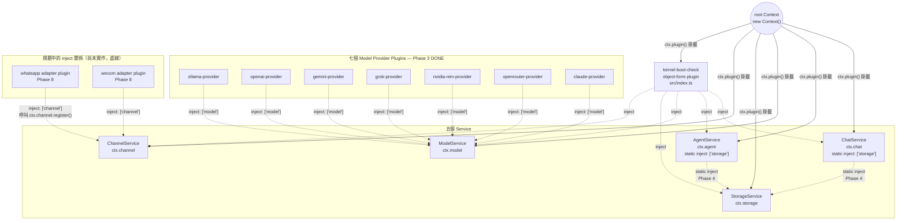

# Cordis 依賴架構圖

跟 [`system-architecture.md`](./system-architecture.md) 是同一套程式碼，但這張圖回答的是
「Cordis 的 plugin/inject 機制實際上長怎樣」，不是「產品功能怎麼串」。兩種箭頭語意不同，
不要混著看：

- **實線箭頭 = `ctx.plugin()` 掛載**（root Context 建立這個 plugin/service）
- **虛線箭頭 = `inject` 依賴宣告**（Cordis 保證被 inject 的 service 先掛載好，這個 plugin 才會執行）

**Phase 4 之後，`ChatService`/`AgentService` 都 `static inject = ['storage']`**——這是
本圖跟 Phase 1-3 版本的主要差異。`ctx.model`/`ctx.channel` 目前還是獨立的 registry，
沒有理由 inject 別人。

## 為什麼 chat/agent 現在要 inject storage，但 model/channel 不用

- `ChatService`/`AgentService` 的方法（`createRoom`、`postMessage`、`createAgent` 等）
  **在執行當下就要真的讀寫資料庫**——沒有 `ctx.storage` 這些方法完全無法運作，所以宣告成
  `static inject`，讓 Cordis 保證掛載順序正確，而不是自己祈禱 `StorageService` 剛好先掛載好。
- `ModelService`/`ChannelService` 是 registry，`register()`/`get()`/`list()` 都只操作
  自己內部的 `Map`，不需要真的依賴誰——沒有理由加 `inject`（YAGNI）。

## `static inject` 是怎麼驗證出來的

Service class（`extends Service`）宣告依賴用的是**靜態屬性** `static inject = [...]`，
跟 function/object 形式的 plugin（例如各 provider plugin）用的 `export const inject = [...]`
不是同一種寫法，但效果一樣：即使 `ctx.plugin(ChatService)` 在 `ctx.plugin(StorageService)`
**之前**呼叫，Cordis 還是會正確延後 `ChatService` 的建構，直到 `storage` 可用為止——這件事
在寫 `ChatService` 之前先寫了一個最小重現腳本驗證過，不是憑印象假設 API 存在
（見 `memory/MEM-20260817-phase4-storage-and-static-inject.md`）。

## 測試裡也用同一套 inject 機制

`src/plugins/storage/index.test.ts`、`src/plugins/chat/index.test.ts`、
`src/plugins/agent/index.test.ts` 各自建立一個乾淨的 `new Context()`，跟
`kernel-boot-check` 一樣的 `inject: [...]` 寫法，只是測試版本每個測試案例都重新建一個
Context，彼此不共用狀態（包含不共用同一個 SQLite 連線——每個測試都是全新的 `:memory:`）。
