# Cordis 依賴架構圖

跟 [`system-architecture.md`](./system-architecture.md) 是同一套程式碼，但這張圖回答的是
「Cordis 的 plugin/inject 機制實際上長怎樣」，不是「產品功能怎麼串」。兩種箭頭語意不同，
不要混著看：

- **實線箭頭 = `ctx.plugin()` 掛載**（root Context 建立這個 plugin/service）
- **虛線箭頭 = `inject` 依賴宣告**（Cordis 保證被 inject 的 service 先掛載好，這個 plugin 才會執行）

**Phase 4 之後，`ChatService`/`AgentService` 都 `static inject = ['storage']`；
Phase 5 起 `OrchestratorService` 也是**（第三個）。`ctx.sandbox` 在 Phase 5.5
補上了 `seatbelt-executor`/`docker-executor` 兩個真的會 `inject: ['sandbox']`
的 plugin（見下圖），但**還沒有任何東西 inject `ctx.sandbox` 本身**——
`task-graph` 策略目前不需要它（沒有 tool calling，沒有東西需要被隔離執行），
只有 `WorkflowDefinition.sandboxExecutor` 這個欄位存在，尚未被使用。雲端 API
executor（例如 E2B）延後，圖中仍標示「延後」，原因見 ADR-0008。

```mermaid
flowchart TD
    root(("root Context<br/>new Context()"))

    subgraph Services["七個 Service"]
        chat["ChatService<br/>ctx.chat<br/>static inject: ['storage']"]
        agentSvc["AgentService<br/>ctx.agent<br/>static inject: ['storage']"]
        model["ModelService<br/>ctx.model"]
        storage["StorageService<br/>ctx.storage"]
        channel["ChannelService<br/>ctx.channel"]
        orchestrator["OrchestratorService<br/>ctx.orchestrator<br/>static inject: ['storage']"]
        sandbox["SandboxService<br/>ctx.sandbox"]
    end

    bootcheck["kernel-boot-check<br/>object-form plugin<br/>src/index.ts"]

    root -->|"ctx.plugin() 掛載"| chat
    root -->|"ctx.plugin() 掛載"| agentSvc
    root -->|"ctx.plugin() 掛載"| model
    root -->|"ctx.plugin() 掛載"| storage
    root -->|"ctx.plugin() 掛載"| channel
    root -->|"ctx.plugin() 掛載"| orchestrator
    root -->|"ctx.plugin() 掛載"| sandbox
    root -->|"ctx.plugin() 掛載"| bootcheck

    chat -.->|"static inject<br/>Phase 4"| storage
    agentSvc -.->|"static inject<br/>Phase 4"| storage
    orchestrator -.->|"static inject<br/>Phase 5"| storage

    bootcheck -.->|"inject"| chat
    bootcheck -.->|"inject"| agentSvc
    bootcheck -.->|"inject"| model
    bootcheck -.->|"inject"| storage
    bootcheck -.->|"inject"| channel
    bootcheck -.->|"inject"| orchestrator
    bootcheck -.->|"inject"| sandbox

    subgraph ModelProviders["七個 Model Provider Plugins — Phase 3 DONE"]
        ollamaP["ollama-provider"]
        openaiP["openai-provider"]
        geminiP["gemini-provider"]
        grokP["grok-provider"]
        nvidiaP["nvidia-nim-provider"]
        openrouterP["openrouter-provider"]
        claudeP["claude-provider"]
    end

    ollamaP -.->|"inject: ['model']"| model
    openaiP -.->|"inject: ['model']"| model
    geminiP -.->|"inject: ['model']"| model
    grokP -.->|"inject: ['model']"| model
    nvidiaP -.->|"inject: ['model']"| model
    openrouterP -.->|"inject: ['model']"| model
    claudeP -.->|"inject: ['model']"| model

    subgraph OrchestratorPlugins["Orchestration Strategy Plugins — Phase 5 DONE"]
        taskGraphP["task-graph-strategy<br/>預設策略，自己寫"]
    end

    taskGraphP -.->|"inject: ['orchestrator', 'agent', 'model', 'chat', 'storage']"| orchestrator
    taskGraphP -.-> agentSvc
    taskGraphP -.-> model
    taskGraphP -.-> chat
    taskGraphP -.-> storage

    subgraph SandboxPlugins["Sandbox Executor Plugins — Phase 5.5 DONE（未在真實環境驗證）· ADR-0008"]
        seatbeltP["seatbelt-executor<br/>macOS 本機"]
        dockerP["docker-executor<br/>本機 Docker Desktop"]
        cloudP["cloud-executor<br/>例如 E2B（延後）"]
    end

    seatbeltP -.->|"inject: ['sandbox']<br/>呼叫 ctx.sandbox.register()"| sandbox
    dockerP -.->|"inject: ['sandbox']"| sandbox
    cloudP -.->|"inject: ['sandbox']（延後）"| sandbox

    subgraph Future["規劃中的 inject 關係（尚未實作，虛線）"]
        whatsappP["whatsapp adapter plugin<br/>Phase 8"]
        wecomP["wecom adapter plugin<br/>Phase 8"]
    end

    whatsappP -.->|"inject: ['channel']（規劃中）<br/>呼叫 ctx.channel.register()"| channel
    wecomP -.->|"inject: ['channel']（規劃中）"| channel
```

## 為什麼 chat/agent 現在要 inject storage，但 model/channel 不用

- `ChatService`/`AgentService` 的方法（`createRoom`、`postMessage`、`createAgent` 等）
  **在執行當下就要真的讀寫資料庫**——沒有 `ctx.storage` 這些方法完全無法運作，所以宣告成
  `static inject`，讓 Cordis 保證掛載順序正確，而不是自己祈禱 `StorageService` 剛好先掛載好。
- `ModelService`/`ChannelService`/`ctx.sandbox` 是純 registry，`register()`/`get()`/
  `list()` 都只操作自己內部的 `Map`，不需要真的依賴誰——沒有理由加 `inject`（YAGNI）。
  `ctx.orchestrator` 是例外：它除了是策略 registry，也身兼 `WorkflowDefinition`
  持久化（`createWorkflow`/`getWorkflow`/`run`），所以需要 `static inject = ['storage']`
  ——這個決定記錄在 MEM-20260820-phase5-task-graph-strategy.md。

## `static inject` 是怎麼驗證出來的

Service class（`extends Service`）宣告依賴用的是**靜態屬性** `static inject = [...]`，
跟 function/object 形式的 plugin（例如各 provider plugin）用的 `export const inject = [...]`
不是同一種寫法，但效果一樣：即使 `ctx.plugin(ChatService)` 在 `ctx.plugin(StorageService)`
**之前**呼叫，Cordis 還是會正確延後 `ChatService` 的建構，直到 `storage` 可用為止——這件事
在寫 `ChatService` 之前先寫了一個最小重現腳本驗證過，不是憑印象假設 API 存在
（見 `memory/MEM-20260817-phase4-storage-and-static-inject.md`）。

## `task-graph-strategy` 是本圖 inject 關係最多的 plugin（已實作）

跟其他 provider/adapter plugin 只 inject 一個 service 不同，`task-graph-strategy`
（`src/plugins/orchestrator/task-graph/index.ts`）真的同時 inject 五個既有
service——`orchestrator`（呼叫 `register()` 把自己註冊進去）、`agent`（查 Agent
定義、解析 `modelRef`）、`model`（真的發起模型呼叫）、`chat`（把結果透過
`postMessage` 發回房間）、`storage`（記錄 `workflow_runs`/`task_node_runs`/
`activity_log`）。這是它獨立成一個 orchestrator 插件、而不是塞進其中任何一個既有
service 的原因——同時依賴五個 service 的邏輯，放進任何一個既有 service 裡都會讓
那個 service 的職責範圍失控。**注意它不 inject `sandbox`**——`WorkflowDefinition`
雖然有 `sandboxExecutor` 欄位，但目前沒有 tool calling，沒有東西需要透過沙盒執行，
所以這個欄位目前是預留但未使用。

`ctx.sandbox` 在 Phase 5.5 補上了兩個真的能用的 executor：`seatbelt-executor`（macOS）跟 `docker-executor`（本機 Docker Desktop）——見 ADR-0008。**「介面能不能建、能不能驗證」不需要等 tool calling**，這是上一輪的說法需要更正的地方；tool calling 只影響「`task-graph`什麼時候真的呼叫 `ctx.sandbox`」，那條 inject 線（圖上 `taskGraphP` 到 `sandbox` 之間）目前還不存在，因為還沒有東西需要被隔離執行。雲端 API executor（例如 E2B）延後，原因見 ADR-0008。

## 測試裡也用同一套 inject 機制

`src/plugins/storage/index.test.ts`、`src/plugins/chat/index.test.ts`、
`src/plugins/agent/index.test.ts` 各自建立一個乾淨的 `new Context()`，跟
`kernel-boot-check` 一樣的 `inject: [...]` 寫法，只是測試版本每個測試案例都重新建一個
Context，彼此不共用狀態（包含不共用同一個 SQLite 連線——每個測試都是全新的 `:memory:`）。
Phase 5 開始實作時，`ctx.orchestrator` 相關的測試會照同一個模式寫。
