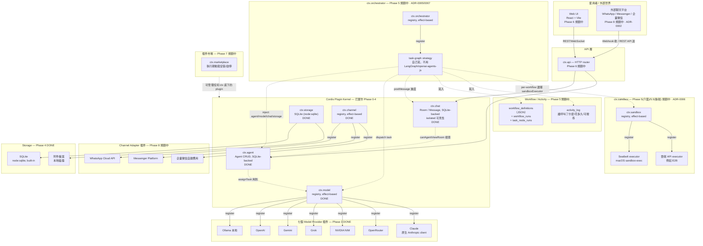

# AI Hub 系統架構圖

> 這份圖用 [Mermaid](https://mermaid.js.org/) 畫（GitHub / VS Code / 大多數 Markdown 檢視器都能直接
> 渲染），語法在寫入前已用 `mermaid.parse()` 實際驗證過，不是手畫 ASCII 對齊猜的。

「DONE」= 已實作。「規劃中」= 尚未實作，標註對應 Phase。

## 圖例對照表

| 元件 | 狀態 | 對應 Phase | 原始碼位置 |
|---|---|---|---|
| `ctx.chat` | 已實作 | Phase 1（骨架）+ Phase 2（domain）+ Phase 4（SQLite） | `src/plugins/chat/` |
| `ctx.agent` | 已實作 | Phase 1（骨架）+ Phase 2（domain）+ Phase 4（SQLite） | `src/plugins/agent/` |
| `ctx.model` | 已實作（registry，effect-based） | Phase 1 骨架 + Phase 3（七個 provider） | `src/plugins/model/` |
| `ctx.storage` | 已實作 | Phase 1 骨架 + Phase 4 SQLite 實作 | `src/plugins/storage/` |
| `ctx.channel` | 已實作（registry，effect-based） | Phase 1，見 ADR-0002 | `src/plugins/channel/` |
| `ctx.orchestrator` | 規劃中，設計已定案 | Phase 5，見 ADR-0005/0007 | `src/plugins/orchestrator/`（尚未建立） |
| `ctx.sandbox` | 規劃中，設計已定案 | 介面：Phase 5；後端：Phase 5.5，見 ADR-0006 | `src/plugins/sandbox/`（尚未建立） |
| workflow_definitions / runs / activity_log | 規劃中 | Phase 5，見 ADR-0005 | `StorageService` schema 擴充 |
| Model provider 插件（7 個） | 已實作 | Phase 3，見 ADR-0003 | `src/plugins/model/{ollama,openai,gemini,grok,nvidia-nim,openrouter,claude}/` |
| Channel adapter 插件 | 規劃中 | Phase 8，見 ADR-0002 | `src/plugins/channel/{whatsapp,messenger,wecom}/` |
| API 層 / Web UI | 規劃中 | Phase 6 | `src/web/` |
| 插件市場 | 規劃中 | Phase 7 | `src/plugins/marketplace/` |

## 資料流重點

1. **訊息永遠先經過 `ctx.chat`**，不論來源是 Web UI、Agent 自己發的、還是外部 channel
   webhook 轉進來的——這是 `Message.sourceChannel` 欄位存在的原因（見 ADR-0002）。
2. **`ctx.model` / `ctx.channel` / `ctx.orchestrator` 都是純 registry**，本身不認識
   任何一家平台或協作策略；認識細節的是各自的 provider/adapter/strategy 插件，插件在
   自己的 `apply(ctx)` 呼叫對應的 `register(...)` 把自己註冊進去，並保留回傳的
   disposer（見 `memory/MEM-20260816-registrations-as-effects.md`）。Kernel 完全
   不用改就能加新平台/新協作策略——這是「萬物皆插件」在這個專案裡的具體落地，
   Phase 5 的 `ctx.orchestrator` 是第三次驗證這個模式（前兩次是 `ctx.model`/`ctx.channel`）。
3. **`ctx.api`（Phase 6）是唯一同時被 Web UI 和外部 channel webhook 觸碰的入口**，兩種來源的
   請求最終都會落到同一套 `ctx.chat`/`ctx.agent` 邏輯，不會有兩套平行的訊息處理路徑。
4. **`task-graph` strategy 是唯一會同時碰四個既有 service 的角色**（`ctx.agent` 查
   Agent 定義、`ctx.model` 發起真正的模型呼叫、`ctx.chat` 把進度發回房間、`ctx.storage`
   記錄 workflow 執行狀態跟 activity log）——這是為什麼它獨立成一個 orchestrator 插件，
   而不是塞進其中任何一個既有 service。

另見 [`cordis-dependency-graph.md`](./cordis-dependency-graph.md)——上面這張圖是「產品功能」視角，
那張圖是「Cordis plugin/inject 機制」視角，兩張圖對應同一套程式碼，但回答不同的問題。
